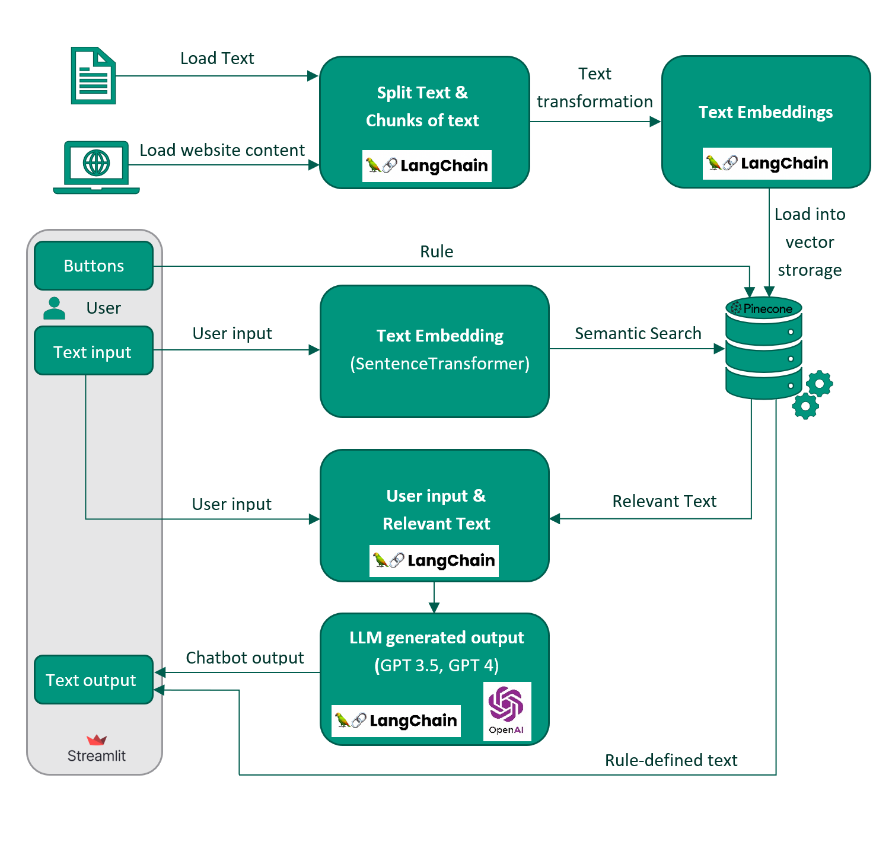

# FISBot - Chatbot for the Faculty of Informatics and Statistics, Prague University of Economics and Business.

Welcome to the FISBot repository, an interactive chatbot developed for the Faculty of Informatics and Statistics at the Prague University of Economics and Business. This chatbot leverages cutting-edge technologies including LangChain, Pinecone, and the powerful GPT-3.5 Turbo model.
## Try Out FISBot!
To try my chatbot visit the following link: [FISBot - Interactive Chatbot](https://fisbot-uyhbasvxvgchkyf8dysbsy.streamlit.app/). You can ask various questions in Czech regarding the faculty, study programs and entrance tests.
## Architecture

Here's a glimpse of FISBot's architecture:

